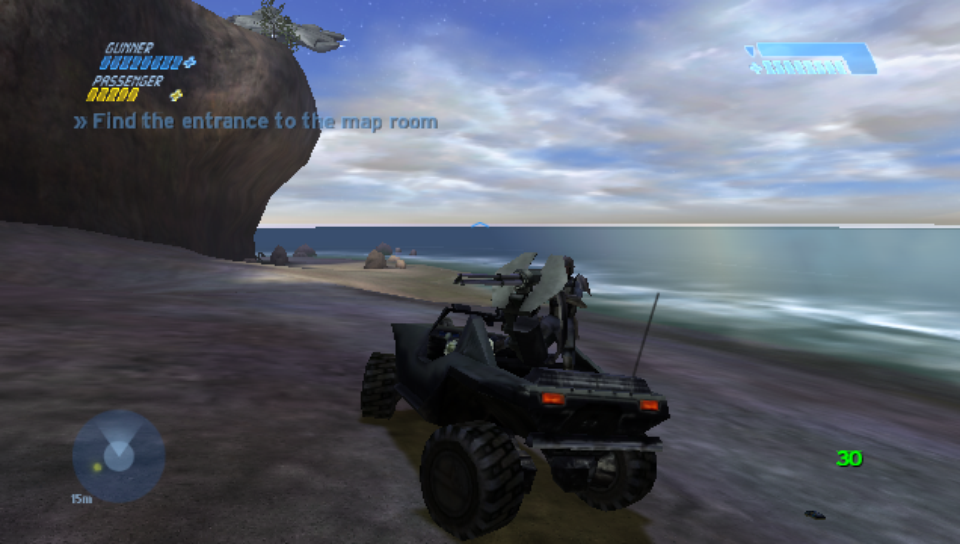
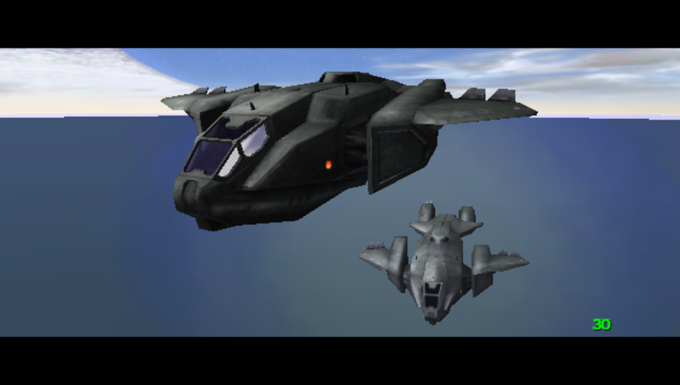
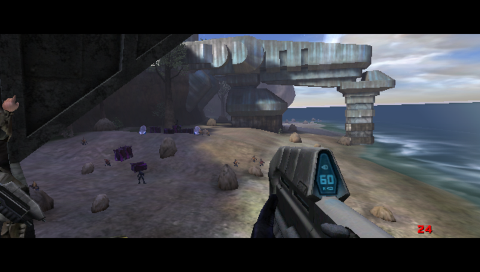
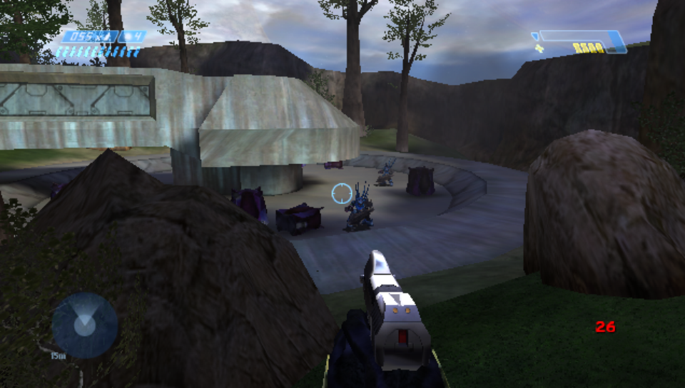

# Halo: Combat Evolved for the PS Vita

A native PlayStation Vita port of **Halo: Combat Evolved**, built from the
decompilation of the Xbox game. It is not an emulator: the game's own code
is compiled for the Vita's ARM processor, and its Direct3D rendering is
translated to the Vita's GPU.

**No game data is included.** You need your own Xbox copy of Halo: Combat
Evolved.



| | | |
| --- | --- | --- |
|  |  |  |

*Screenshots taken on a PS Vita.*

[](https://youtu.be/S6CrPv_F2jU)

*Video: [Halo CE PS Vita port v1.0.3 | Stability Update](https://youtu.be/S6CrPv_F2jU).*

> **Official sources.** The only official downloads are the
> [releases on this GitHub repository](https://github.com/BirchWoodGod/halo-ce-vita/releases),
> published by **BirchWoodGod**. VPKs, "updates", mods or donation requests
> offered anywhere else under this project's or the developer's name are not
> from me. If in doubt, check that a build is listed on the releases page.

## What works

- The whole campaign from the menus, with checkpoints, saves and Save and
  Quit, cinematics, and the movies (converted to MP4, see below).
- Multiplayer maps on your own (split screen with one player). System link
  between Vitas on the same Wi-Fi; online play (short codes, a server
  browser of public games, from OpenCE) and ad hoc play between Vitas, experimental. Vitas play only
  Vitas: PCs cannot join a Vita's game, nor a Vita a PC's.
- Campaign co-op over the network, experimental: up to four Vitas play a
  level together by system link, online or ad hoc (Campaign, a level and a
  difficulty, then **Y: Play co-op**;
  [port/vita/README.md](port/vita/README.md#multiplayer)).
- Profiles, controller settings and the game's settings menus.
- A settings panel for the Vita's quality, sound, control and multiplayer
  options, custom maps and tester switches: hold **Select + Start** in game.
- Up to 30 fps. Quiet areas and cinematics hold 25 to 30 fps; the biggest
  fights drop to the mid-to-high teens. See [Performance](#performance).

### Known issues

The current list is in the [roadmap](ROADMAP.md) and the
[issues](https://github.com/BirchWoodGod/halo-ce-vita/issues). The main
one: the biggest fights still drop frames (see [Performance](#performance)).

## Install

### What you need

- A PS Vita or PS TV with HENkaku/Ensō (firmware 3.60 to 3.74) and
  [VitaShell](https://github.com/TheOfficialFloW/VitaShell/releases).
- **The Vita's shader compiler, `ur0:data/libshacccg.suprx`.** Many ports
  need it, so you may have it already. If not, install
  [ShaRKF00D](https://github.com/Rinnegatamante/ShaRKF00D/releases) and
  run it once: it extracts the file to `ur0:data/`. Without it the game
  stays on the loading picture while the menu's music and sounds play.
- About 1.5 GB free on `ux0:` (the game keeps decompressed copies of the
  levels it loads).
- Your own **Xbox** copy of Halo: Combat Evolved (the disc, or an image of
  it). It must be the Xbox version: the PC version's maps do not work.

### Steps

1. **Download `halo.vpk`** from the
   [latest release](https://github.com/BirchWoodGod/halo-ce-vita/releases/latest).
2. **Install it.** Copy the VPK to the Vita (VitaShell's USB or FTP mode),
   open it in VitaShell and confirm. The bubble is called **Halo CE**.
3. **Get the game files from your disc.** An Xbox disc image (an `.iso`,
   often called an XISO: the same thing) is unpacked by
   [extract-xiso](https://github.com/XboxDev/extract-xiso):
   `extract-xiso -x "Halo.iso"` makes a folder with the disc's files. You
   need two things from it: the `maps` folder and `default.xbe`. (Already
   unpacked game files, as many backups come, work as they are.)
4. **Copy them to the Vita**, with VitaShell's USB or FTP mode:

   ```
   ux0:data/haloce-vita/maps/         <- the whole maps folder (ui.map, a10.map, bloodgulch.map ...)
   ux0:data/haloce-vita/default.xbe   <- the loading screen's picture is read from it
   ```

5. **Start the game.** The first load of each level takes a while: the
   game writes a cache file for it to the memory card.

Without the maps the game shows where to copy them and exits.

**Stuck on the loading picture** while the menu music plays? The shader
compiler is missing: see `libshacccg.suprx` above. `halo.log` says so with
the line `gxm: no libshacccg.suprx`.

### Updating

Install the new `halo.vpk` over the old one. Your maps, saves and settings
in `ux0:data/haloce-vita/` are kept.

### Movies (optional)

The Xbox movies are Bink files, which the Vita cannot play. Convert them
(the disc's `bink` folder) to H.264 MP4 and put them in
`ux0:data/haloce-vita/movies/` under the same names (`intro.mp4`,
`credits.mp4`, `attract1.mp4` ...):

```
ffmpeg -i intro.bik -c:v libx264 -profile:v baseline -level 3.1 -pix_fmt yuv420p \
       -vf scale=640:-2 -c:a aac -b:a 128k intro.mp4
```

For better quality at the same size, High profile also plays (thanks to
maler82, #8):

```
ffmpeg -i intro.bik -c:v libx264 -profile:v high -level 4.0 -crf 20 -pix_fmt yuv420p \
       -vf scale=640:-2 -c:a aac -b:a 128k -movflags +faststart intro.mp4
```

A movie without an MP4 is skipped, as the game skips a missing movie.

A movie is scaled to fill the screen at the shape its file gives, with
black bars only where that shape needs them: the Xbox's 4:3 movies fill the
height, and any 16:9 encoding fills the width - 640x360, 848x480, 960x544,
or 640x480 made with ffmpeg `-aspect 16:9`. Any size up to 960x544 plays.
`HALO_MOVIE_ASPECT=16:9` in `env.txt` forces a shape for files without one.

### Custom maps (optional)

Community-made multiplayer maps go in `ux0:data/haloce-vita/maps/`, next to
the game's own. Two kinds work:

- **Xbox custom maps**: copy the `.map` in. Nothing else is needed.
- **Halo PC / Custom Edition maps** (`.map`, and OpenSauce `.yelo`;
  experimental): these need three resource maps from your own copy of Halo
  on PC, `bitmaps.map`, `sounds.map` and `loc.map`. Two of them,
  `bitmaps.map` and `loc.map`, also give the game's Multiplayer menu the PC
  version's screens (a server browser, Join by code, Server Setup). Three
  ways to get them, easiest first:
  1. **The Halo Custom Edition installer**: copy your
     `halocesetup_en_1.00.exe` (or another language's `halocesetup*.exe`,
     about 170 MB) to `ux0:data/haloce-vita/`. At the next start the game
     takes the three out of it into the maps folder (about a minute; a
     progress line shows, Circle stops it), then asks whether to delete the
     installer to free the space. Nothing to unpack on a PC. The PC
     multiplayer menus show from the start after that one.
  2. **Halo: The Master Chief Collection** (Steam): copy the three from
     `steamapps/common/Halo The Master Chief Collection/halo1/maps/custom_edition/`
     to `ux0:data/haloce-vita/maps/`. Take them from the `custom_edition`
     folder, not the ones in `halo1/maps`, which are MCC's own and do not
     work.
  3. **A Halo Custom Edition install** (PC): copy the three from its `maps`
     folder (`C:\Program Files (x86)\Microsoft Games\Halo Custom Edition\maps\`)
     to `ux0:data/haloce-vita/maps/`. (On a PC without an install,
     `tools/ce_installer_extract.c` takes them out of the installer, as the
     game does; how to build it is at its top.)

  Then turn on **PC maps** in the settings panel (Select + Start,
  Multiplayer, Modded maps). The page lists your custom maps and warns if a
  resource map is missing; with an installer in `ux0:data/haloce-vita/`,
  its **Extract PC files** row takes them out of it again (after a start
  where you stopped it, say).

Custom Edition maps themselves (race tracks and the like) come from the
community's Halo CE map archives and forums. This project includes no maps
and links to no downloads.

### PC multiplayer menus (optional)

With Halo PC's `bitmaps.map` and `loc.map` in `ux0:data/haloce-vita/maps/`
(the same Custom Edition files as for custom maps above: from MCC's
`halo1/maps/custom_edition/`, or a Custom Edition install's `maps` folder;
`sounds.map` is not needed for this), the main menu's **Multiplayer** opens
the PC version's Multiplayer screen, from OpenCE's PC menus:

- **Join Game**: **Internet** is the server browser (the public games, a
  lock on those with a password; A joins, a locked game's password is typed
  on the Vita's keyboard; Square refreshes), **LAN** the System Link screen,
  **Join by code** a host's code.
- **Create Game**: **Internet** is Server Setup: the lobby name, max players,
  visibility (public: in everyone's server browser; private: joined by its
  code) and password, which are kept - then your profile, the map and the
  gametype; the settings panel's Multiplayer tab shows your game's code.
  **LAN** is the System Link screen (Y creates a game).
- **Co-op campaign** (pick a level and a difficulty, then Y; up to four
  players; online the game is private, joined by its code, unless X on its
  waiting screen makes it public), **Split screen** and **Edit gametypes**,
  as before.

Internet and Join by code need **Connection: Online** (settings panel,
Multiplayer); the screen says so otherwise. The pictures and text are read
from your own `bitmaps.map` and `loc.map` the first time the screen opens;
none of Bungie's files are in this project. Without the two files, the
Xbox's Multiplayer screen opens as before: System Link hosts (online too,
with the settings last chosen) and joins, and the settings panel's **Join
with a code** joins a code; the public games' browser needs the files.

Only the host needs the custom map: a Vita that joins without it is asked
whether to download it from the host in the lobby (and, for a Custom
Edition map, to turn PC maps on). A joiner still needs its own three
resource maps. The host waits for the download before the game starts, and
a download that stops goes on from where it stopped the next time.
Big Custom Edition maps can be slow on the Vita or too large for its memory.
The question names the host; in a game joined from the public lobby it also
warns that the host is a stranger: only accept maps from players you trust.
**Map downloads** on the Modded maps page sets this: **Ask** (the default),
**Not public games** (no downloads in games from the public lobby) or
**Never**.

### Saving

Checkpoints are written to the memory card as you play. To continue,
choose the campaign again with the same profile and difficulty. **Save and
Quit** from the pause menu is the safest way to stop.

## Controls

| Vita | Xbox | In game |
| --- | --- | --- |
| Left stick / right stick | left stick / right stick | move / look |
| Cross | A | jump |
| Circle | B | melee |
| Square | X | reload, action |
| Triangle | Y | switch weapon |
| D-pad left / right | Black / White | switch grenades / flashlight |
| L / R | left trigger / right trigger | throw grenade / fire |
| D-pad down | left stick click | crouch (a toggle; see the panel) |
| D-pad up | right stick click | zoom |
| Start | Start | pause; skips a cinematic |
| Select | Back | scoreboard |
| Select + Start (hold) | | settings panel |

The settings panel's **Controls** tab has two pages laid out as the Xbox
controller: **Button layout** puts each Xbox button (A, B, X, Y, Black,
White, the triggers, the sticks' clicks, Back) on another Vita button (in
play; the menus keep Cross / Circle and the D-pad), and **Touch zones**
makes each zone press an Xbox button. **Button icons**, the first row of
Button layout, is Xbox by default: the game's own Xbox button icons. With
**PlayStation** every button prompt (the HUD's "Press X to...", the menus'
button hints) shows the Vita button that does it now instead: Cross, Circle,
Square and Triangle drawn in the Xbox icons' place in the PlayStation's
colours, L, R, Start, Select, the D-pad and the touch zones by name. It
follows your Button layout and touch zones (in the menus their fixed layout)
and applies at once. The settings panel keeps the Xbox controller's names
(A, B, X, Y, Black, White ...) either way.
The zones, all Off until set:

| Zone | Where |
| --- | --- |
| Touch top left / top right | front screen, the top corners (over the ammo and shield readouts) |
| Touch left edge / right edge | front screen, the middle of each side, beside the D-pad and the face buttons |
| Rear touch left / right | the rear pad's left and right halves (a strip in the middle is neither) |

Each can be A, B, X, Y, Black, White, Left trigger, Right trigger, Left
stick (its click: crouch, Hold or Toggle as the Crouch row says), Right
stick (its click: zoom) or Back. A front zone counts at once; a rear one
goes through the **Rear touch guard** row, so the hands holding the Vita do
nothing: a touch that starts near the rear pad's edges never counts, and one
further in only once held (Normal, the default: a 96-pixel border, 0.25 s;
Light 48 / 0.15 s, Strong 144 / 0.4 s, Off no border and 0.1 s). A touch that starts outside a zone does nothing, and each finger
counts on its own. The Touch zones page shows where the zones are.
**Reset controls** (Controls, Advanced) puts look, crouch, the buttons and
the zones back as shipped (gyro aiming, Button icons and Show dev settings stay).

**Gyro aiming** (the panel's Controls tab, its details on the **Gyro
settings** page; Off until set): turning the Vita
turns the view, on top of the right stick, as if you looked through the
Vita: turn it left and right (or, with **Gyro turning** Tilt, steer it like
a wheel) to turn, tilt its top edge towards you to look up. **Gyro aiming**
is Off, On, While zoomed (only through a scope) or While holding the **Gyro
button** (L by default; in play that button then only aims, so put its
Xbox button on another one). **Gyro sensitivity** 0.5x to 3x (1.5x by
default; 1x turns the view as far as the Vita turns, less while zoomed, as
the stick is), **Gyro vertical** Normal or Inverted. It aims only in play,
not in the menus, the panel or cinematics. Lay the Vita still for a second
now and then (the page's line says "learnt" once it has): that teaches it
the gyroscope's drift, so a resting Vita does not turn the view. Gyro
motion does not keep the screen from dimming.

## Settings panel

Hold Select + Start for a second. **L and R** switch between its four tabs,
**Graphics**, **Controls**, **Audio** and **Multiplayer**, and **Dev** once
**Show dev settings** (Controls, Advanced) is on. Up and down choose a line,
left and right change it, Cross opens a line marked `>` (a page of the
rows few players change, such as Button layout, Touch zones, Gyro
settings, Modded maps or Graphics' Advanced) or does what it says, Circle
goes back from a page or closes the panel. The chosen line's help and the
panel's buttons are at the bottom. Changes apply at once, render resolution and
aspect ratio included (the picture pauses for a moment while the screen is
set up again), except the rows marked `*` (sound voices, the network, most
dev switches), which apply after a restart; the panel says so. A bigger
resolution makes room in video memory first (unused copies of the screen
and part of the texture cache move out, and the textures in it load again);
only if it still does not fit does the panel say the change waits for a
restart. Settings are kept in
`ux0:data/haloce-vita/settings.txt` (a file from an older version loads as
it is).

- **Multiplayer**: the network (**Connection**: Same Wi-Fi, Ad hoc or
  Online), and with Ad hoc the room and **Join the room** (the system's
  dialog joins its group). Hosting and joining are in the game's own
  Multiplayer menu ("PC multiplayer menus" above, or the Xbox's System
  Link); without the Halo PC files, online, **Join with a code** types a
  host's code here. Your game's code and what the game is doing show under
  the rows (see [port/vita/README.md](port/vita/README.md#multiplayer)).
- **Modded maps** (a Multiplayer page): the custom maps in your maps folder, with their size and
  kind (Xbox, or CE for Halo Custom Edition). Left and right turn a map off
  (it stays on the card but leaves the map list) or on; Square deletes it
  after asking. **PC maps** puts Custom Edition maps in the map list
  (experimental); the page warns when the Custom Edition `bitmaps.map`,
  `sounds.map` or `loc.map` they need are missing.
- **Dev**: switches for testing (timing in `halo.log`, a crash dump when the
  game hangs, the FPS overlay, A/B switches a bug report may ask for) and
  **Save report** (below). While any switch is on, `halo.log` says
  "TEST MODE" near its top.

The **Profile** row at the top sets the speed-related rows together
(render resolution, model detail, hide distant objects, object shadows,
dynamic lights, effects quality, particle density, sun rays, scenery
updates, object lighting, AI think rate, sound occlusion and sound updates):
**Performance**, **Balanced** (the defaults) or **Quality** (the game as on
the Xbox). Changing one of those rows yourself turns the profile to
**Custom**.

**Aspect ratio** 16:9 (the default) fills the Vita's screen with a wider
view; 4:3 shows the Xbox's own framing, field of view, HUD and menus between
black bars. **Upscale filter** Smooth (the default) or Sharp chooses how the
picture is scaled to the 960x544 screen: Smooth blends pixels, Sharp keeps
them crisp and blocky (most visible at lower render resolutions).

## Performance

Measured on a PS Vita 1000 with 1.0.3's default settings:

| Where | Frame rate |
| --- | --- |
| Menus, cinematics, quiet areas | 25 to 30 fps |
| Ordinary fights | 20 to 30 fps |
| The Silent Cartographer's beach landing | about 18 to 19 fps at its busiest |
| Pillar of Autumn's biggest firefights | about 15 to 18 fps |
| Late-game Flood and Covenant battles | can drop lower; 1.0.3 cuts the GPU work there |

Why it slows down: the biggest fights are limited by different things in
different places. On The Silent Cartographer's beach the Vita's processor is
the limit (drawing many characters, and the game's own simulation of them),
so the render resolution changes little there. In Pillar of Autumn's
firefights the graphics chip is the limit, and there **Render resolution 50%**
helps a lot (in one test, a firefight went from about 16 fps at 75% to about
26 fps at 50%), at the cost of a softer picture.

Recommended settings (the **Profile** row sets these at once):

| Setting | Performance | Balanced (default) | Quality |
| --- | --- | --- | --- |
| Render resolution | 50% | 75% | 100% |
| Model detail | Low | Low | High |
| Hide distant objects | Small | Small | Off |
| Scenery updates | Quarter | Quarter | Every tick |
| Object lighting | Third | Third | Full |
| Object shadows | Off | Near only | Full |
| Dynamic lights | 4 | 8 | All |
| Effects quality | Performance | Full | Full |
| Particle density | Half | Full | Full |
| Sun rays | Off | On | On |
| AI think rate | Adaptive | Adaptive | Every tick |
| Sound occlusion | Every 6th | Every 3rd | Every tick |
| Sound updates | Every 2nd | Every 2nd | Every frame |
| Best for | the biggest fights, Pillar of Autumn | most of the game | quiet areas, cinematics, screenshots |

Performance is the one to pick if the late-game battles feel slow; Quality
draws, sounds and plays exactly as on the Xbox and runs well in quiet areas.
Balanced and Performance think less often for far-off enemies and update
the sounds every other frame, so a fight plays a little differently from
the Xbox's (the shadows, lights, effects and particles change only what is
drawn). Object shadows, Dynamic lights, Effects quality, Particle density,
AI think rate and Sound updates come from Bruno Santana's modified build. None
of them drops see-through parts such as the Covenant field generators'
domes or visors: models keep them at the Xbox's detail level, and the
domes are drawn at any distance.

What helps, in the settings panel:

- **Render resolution** 50% (applies at once, as does **Aspect ratio**): the
  biggest gain in graphics-heavy fights such as Pillar of Autumn's.
  **Dynamic** (experimental) lowers the resolution only while the graphics
  chip is the limit and goes back up to 100% when it is not, down to the
  **Dynamic minimum** (50% by default).
- **Model detail** Low or Lowest: characters and vehicles far away are drawn
  with fewer polygons.
- **Hide distant objects** Small or Medium: tiny far-away objects are skipped.
- **Scenery updates** and **Object lighting** at Quarter / Third (the
  defaults).
- **Sun rays** Off: no glow and light shafts around the sun outdoors, which
  cost the graphics chip several small extra passes a frame while the sun
  is in view.
- **Sound voices** 16: fewer positional sounds at once.
- Keep **Smooth weapon motion** on: it costs almost nothing and makes the
  frame rate feel steadier.

### More performance with plugins (optional)

Two optional plugins give the game more of the Vita's processor. Neither is
needed, and the game runs the same without them.

- **[CapUnlocker](https://github.com/GrapheneCt/CapUnlocker)** by GrapheneCt
  lets games use the Vita's fourth CPU core, which the system normally keeps
  for itself. With it, the **Fourth core helpers** setting (Graphics >
  Advanced; **All async** by default; it applies after a restart) moves
  background work onto that core: **Audio** moves the sound mixer, **All async** also the display
  queue, loading, map decompression, checkpoint writing, shader compiling
  and the log. The game, render and tick threads never move. If core 3
  stays very busy and the frame rate drops, use Audio. Without it the setting
  does nothing and `halo.log` says so. To install: copy `CapUnlocker.skprx`
  from its releases to `ur0:tai/`, add the line `ur0:tai/CapUnlocker.skprx`
  under `*KERNEL` in `ur0:tai/config.txt` (keep a copy of the file first: a
  mistake there stops plugins loading), and reboot.
- **[PSVshell](https://github.com/Electry/PSVshell)** (or PSVshellPlus)
  raises the processor to 500 MHz, which helps in the biggest fights at some
  cost in battery and heat. The game keeps a higher speed set there; it only
  raises the clock when it is lower than the game needs.

A steady 30 fps in the biggest fights is a goal for 1.1.0 (see the
[roadmap](ROADMAP.md)). If you want to help measure, add these lines to
`ux0:data/haloce-vita/env.txt`, play a heavy fight for a couple of minutes,
and attach `ux0:data/haloce-vita/halo.log` to an issue:

```
HALO_FRAME_TIMING=300
HALO_RENDER_PROFILE=1
HALO_TICK_PROFILE=1
```

## Building

### What you need

- Linux (or WSL on Windows) with **Python 3**, **ninja** and **clang 17 or
  newer** (the game code is compiled by clang with the game's MSVC-like ABI).
- **[VitaSDK](https://vitasdk.org)** for the Vita side (compiled by its
  GCC) and the packaging tools. Install it with
  [vdpm](https://github.com/vitasdk/vdpm) and set `VITASDK` (or put it in
  `~/vitasdk`).

For example, on Ubuntu or Debian:

```
sudo apt install git python3 ninja-build clang lld curl
export VITASDK=/usr/local/vitasdk
export PATH=$VITASDK/bin:$PATH        # (add both lines to ~/.bashrc)
git clone https://github.com/vitasdk/vdpm && cd vdpm
./bootstrap-vitasdk.sh && ./install-all.sh && cd ..
```

### Build

```
git clone https://github.com/BirchWoodGod/halo-ce-vita
cd halo-ce-vita
python3 configure.py --lto off --pgo off --portable --release
ninja vita
```

The results are `build/vita/eboot.bin` and `build/vita/halo.vpk`. Install
the VPK as above, or, with an FTP server running on the Vita (VitaShell's
SELECT), replace just the executable:

```
curl -T build/vita/eboot.bin ftp://<vita address>:1337/ux0:/app/HCEV00001/eboot.bin
```

Run `configure.py` again after adding a source file or changing anything in
`port/vita/sce_sys` (the LiveArea images and the title).
[port/vita/README.md](port/vita/README.md) has the details: the layout of
`port/vita`, testing in [Vita3K](https://vita3k.org) and in a Linux build of
the Vita renderer, debug switches, and the files the game keeps on the
memory card.

## Contributing

Issues and pull requests are welcome. What is planned next is in the
**[roadmap](ROADMAP.md)**. Open work:

- **Performance** in the biggest fights: the render on the first core is
  the limit at the peak.
- **Testing online and ad hoc multiplayer** between Vitas: the game's
  Multiplayer menu (see [port/vita/README.md](port/vita/README.md)).
- **The issues listed for the next update** in the roadmap.

### Reporting a crash or a problem

Open an [issue](https://github.com/BirchWoodGod/halo-ce-vita/issues) with
what you were doing (level, place, weapon, vehicle) and these files from
the memory card (VitaShell's FTP or USB mode). The settings panel's **Save
report** (Controls, Advanced: Show dev settings, then the Dev tab) copies `halo.log`,
`halo-prev.log`, `settings.txt`, `env.txt` and the newest crash dump into
one folder, `ux0:data/haloce-vita/report-<date>/`, for you to send; add
`debug.txt`.

- `ux0:data/haloce-vita/halo.log` and `halo-prev.log`: the port's logs of
  this and the previous session (the previous one is the crashed one after
  a restart).
- After a crash, the newest `ux0:data/psp2core-....psp2dmp`: the crash
  dump. Leave the Vita alone for a minute after a crash so it finishes
  writing it (a dump still being written ends in `.tmp`).
- `ux0:data/haloce-vita/data/debug.txt`: the game's own log.

## Credits

This port stands on a lot of other people's work:

- **Bungie** made Halo: Combat Evolved. Halo is a trademark of Microsoft.
- **[punpckhdq/halo](https://github.com/punpckhdq/halo)**: the decompilation
  of the Xbox build 2342 (`cachebeta.exe`, SHA-256
  `4cc87b45f721270392a96f1674ed2b5cd4a7bb4355faeab4531d1cf1884d9520`),
  including the decompiled Xbox libraries in `libs/` (Direct3D 8, the C
  runtime, XAPI, Bink).
- **[bnunu/halo-1](https://github.com/bnunu/halo-1)**: the fork of that
  decompilation the native port starts from.
- **[OpenCommunityEdition/OpenCE](https://github.com/OpenCommunityEdition/OpenCE)**
  (formerly halo-ce-universal):
  the native Linux, Windows and Android port this repository is built on:
  the platform layer, the OpenGL renderer the Vita renderer is modelled on,
  the distributed netcode, system link over the internet, the server
  browser of public games (signed listings, password-protected games, its
  Players and Rules lines), the PC menus' multiplayer screens (Server
  Browser, Server Setup, the password and Direct Link screens and their
  header art, read with [Expat](https://libexpat.github.io)), and much more.
  Those platforms still build from this tree (`port/linux`, `port/windows`,
  `port/android`, each with its own README). Campaign co-op over the
  network is theirs too (xshxdex98's and MrBruh's work: `network_coop.c`,
  `coop_spectate.c`, `coop_scripts.c`, `network_actors.c`), brought in with
  its commits' history and authors.
- **[bnunu/halo-ce-universal](https://github.com/bnunu/halo-ce-universal)**
  (Jonas Volman): the Halo Custom Edition and OpenSauce map loader and its
  conversions (`port/linux/game/cache_file_formats.c`,
  `custom_edition_*.c`, `docs/custom_edition_caches.md`), which the
  custom maps work builds on.
- **[Invader](https://github.com/SnowyMouse/invader)** by SnowyMouse: the
  tag definitions `port/linux/src/tag_layouts.h` is generated from (by
  `tools/gen_tag_layouts.py`), which let the port relocate the maps' tags.
- **[Xita](https://github.com/Xita-Project/xita)**: the earlier work on running Halo on the Vita, whose
  findings (the register combiner translation, the GPU and threading
  lessons, the tools) went into this port.
- **Bruno Santana**: his modified build of this port showed the Vita's
  fourth core running helper work, frame interpolation at 60 fps and more
  graphics settings, which the 1.1.0 work on those builds on.
- **PS Vita port**: BirchWoodGod.

### Testers

Thank you to everyone who played the releases and betas on their own Vitas
and reported what they found, with crash dumps, logs, saves and screenshots:
[BlazeRed17](https://github.com/BlazeRed17), [ItsSamStone](https://github.com/ItsSamStone), [Benixio](https://github.com/Benixio), [DuckiEXP](https://github.com/DuckiEXP), [5ackwood](https://github.com/5ackwood), [Andiweli](https://github.com/Andiweli), [maler82](https://github.com/maler82), [rbxshh](https://github.com/rbxshh), [nxble6](https://github.com/nxble6), [LordLavaLamp](https://github.com/LordLavaLamp), [KiddRwxSsj](https://github.com/KiddRwxSsj), [GrookyGamez](https://github.com/GrookyGamez), [aguy4809-art](https://github.com/aguy4809-art), [iamayod](https://github.com/iamayod); **CallumBlackGames**, for the first two-Vita multiplayer video; and
**psvita_dude** and the testers on Discord. Many of the fixes in 1.0.1 to
1.0.3 exist because of your reports.

Libraries and tools: [VitaSDK](https://vitasdk.org),
[SDL3](https://github.com/libsdl-org/SDL) (desktop builds),
[tomlc17](https://github.com/cktan/tomlc17),
[KCP](https://github.com/skywind3000/kcp),
[Monocypher](https://monocypher.org) (the server browser's signatures and
password keys),
[Expat](https://libexpat.github.io) (the PC menus' files),
[Mbed TLS](https://github.com/Mbed-TLS/mbedtls),
[miniupnpc](https://github.com/miniupnp/miniupnp),
[libmspack](https://github.com/kyz/libmspack) by Stuart Caie (LGPL 2.1:
Halo Custom Edition's resource maps out of its installer),
[musl](https://musl.libc.org)'s math functions,
[extract-xiso](https://github.com/XboxDev/extract-xiso), and
[Vita3K](https://vita3k.org) for testing.

## License

This port is licensed under the **GNU General Public License, version 3
only** ([LICENSE](LICENSE)), because `port/linux/src/tag_layouts.h` is
generated from Invader's GPL-3.0 tag definitions. To regenerate it, clone
Invader into `invader/` (or set `INVADER=<path>`) and run
`python3 tools/gen_tag_layouts.py port/linux/src/tag_layouts.h`.

The decompilation and the OpenCE (halo-ce-universal) port this builds on are
dedicated to the public domain under CC0 1.0
([LICENSES/CC0-1.0.txt](LICENSES/CC0-1.0.txt)); the bundled libraries keep
their own licenses. The license covers this code only: Halo's maps,
executable and other game content belong to their owners and are not
included.

This project is not affiliated with or endorsed by Microsoft or Bungie,
and it contains no game assets.
